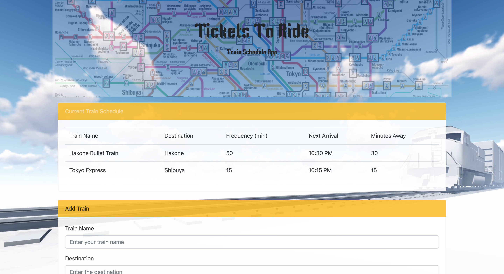

# Train-Scheduler

## What is This App?
This is an app where it display the schedule of trains. Click [HERE](https://yusungsamuel.github.io/Train-Scheduler/) to be directed to the app.

## How to Use It?
The user may enter in the name of their train, the destination, the time it starts running, and the frequency in the form at the bottom of the page. Once the user hit the add button, the information will be added to the current train schedule box in the middle of the page. In addition to what the user had enter, the app will calculate the next train arrival time and the waiting time.

## Technologies Used:
+ HTML
+ CSS
+ Bootstrap
+ Javascript
+ Firebase
+ jQuery

